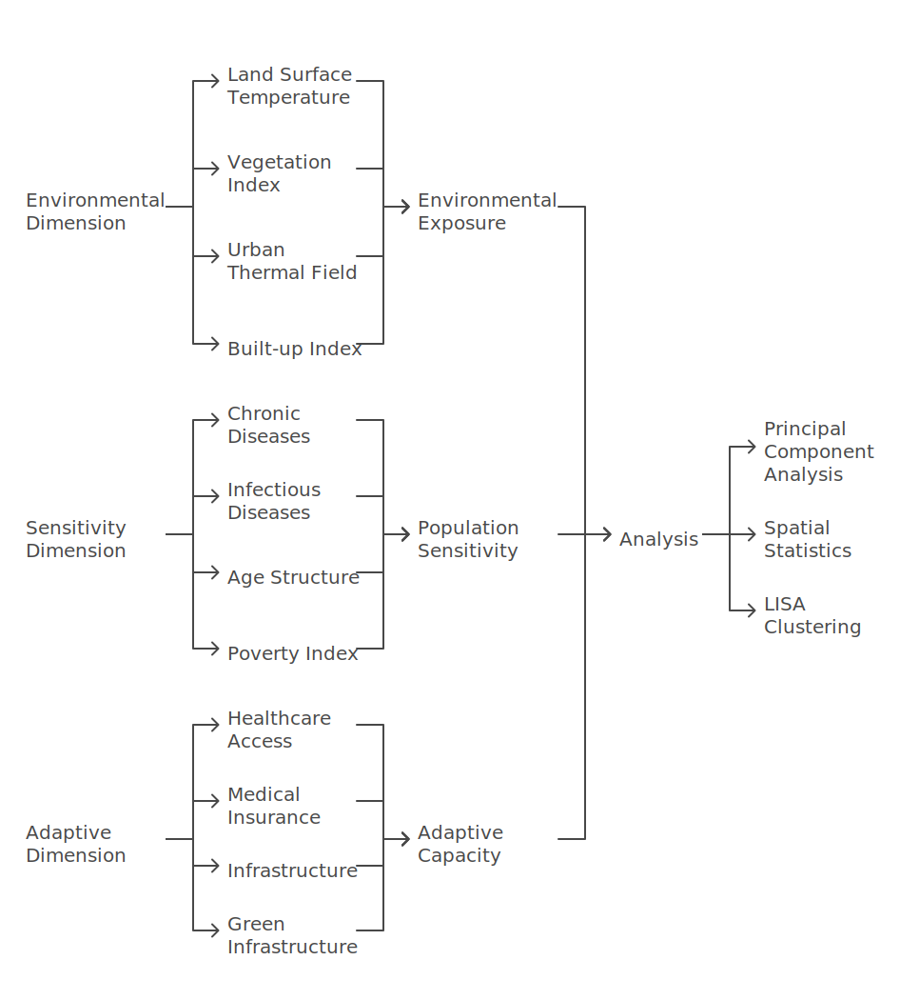
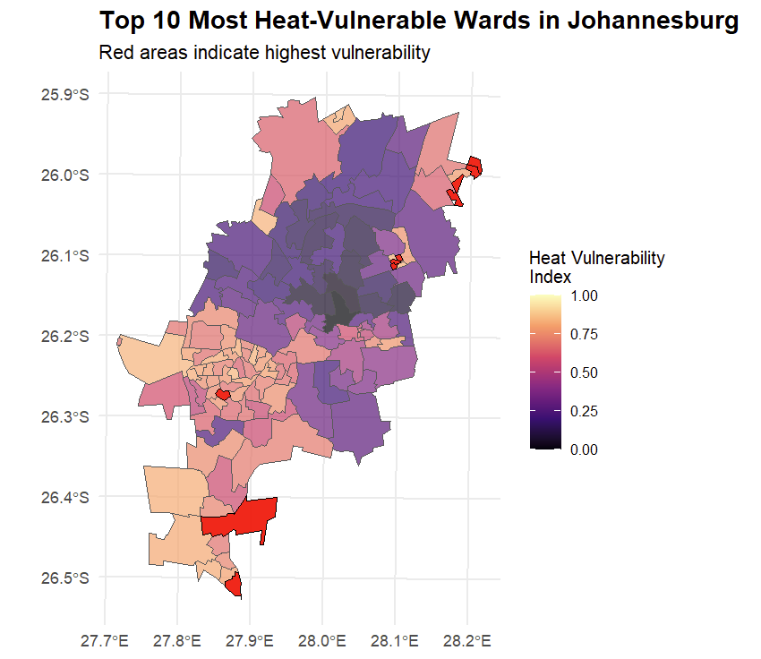
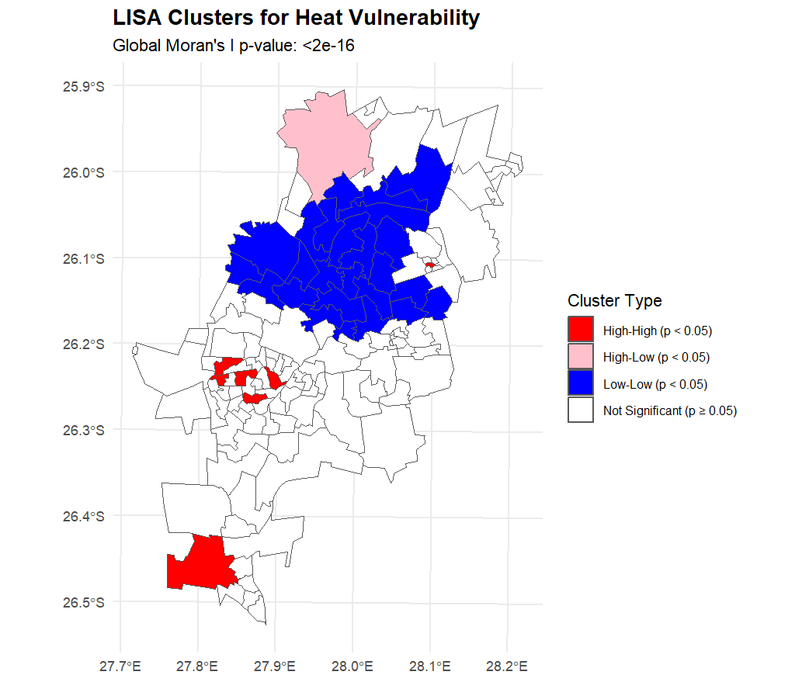

# Quantifying intra-urban socio-economic and environmental vulnerability to extreme heat events in Johannesburg, South Africa

## Authors

Craig Parker¹*, Craig Mahlasi², Tamara Govindasamy², Lebohang Radebe¹, Nicholas Brian Brink¹, Christopher Jack³, Madina Doumbia⁴, Etienne Kouakou⁵, Matthew Chersich¹, Gueladio Cisse⁴, Sibusisiwe Makhanya², for the HE²AT Center Group

## Affiliations

1. Wits Planetary Health Research, Faculty of Health Sciences, University of the Witwatersrand, Johannesburg, South Africa
2. IBM Research - Africa, South Africa
3. Climate System Analysis Group, University of Cape Town, South Africa
4. University Peleforo Gon Coulibaly, Côte d'Ivoire
5. Centre Suisse de Recherches Scientifiques, Côte d'Ivoire

The HE²AT Center Group consists of: Aakin Bobola, Abdoulaye Tall, Achiri Ndikum, Adaji Aishatu, Adja Ferdinand Vanga, Admire Chikandiwa, Akbar Waljee, Amy Beukes, Andrew Meme, Anna Steynor, Bonnie Joubert, Brama Kone, Bruce Hewitson, Cathy Mwangi, Cherlynn Dumbura, Christopher Jack, Chuansi Gao, Craig Mahlasi, Craig Parker, Darshnika Lakhoo, Donrich Willem Thaldar, Duncan Mitchell, Dusty-Lee Donnelly, Elizabeth Frederick, Etienne Vos, Gciniwe Dlamini Baloyi, Gillian Marmelstein, Gueladio Cissé, Hendrik Hamann, Iba Dieudonné Dely, Ijeoma Solarin, Ilias Maliha, Jasper Maguma, Jetina Tsvaki, Ji Zhu, Khady Sall, Kimberly McAlpine, Komminist Weldemariam, Kwesi Quagraine, Lebohang Radebe, Leon Mbano, Lisa, Lois Harden, Lukman Abdulrauf, Madina Doumbia, Margaret Brennan, Matthew Chersich, Kimberly McAllister, Nicholas Brian Brink, Nontokozo Langa, Okoue Emerence, Olumuyiwa Adegun, Paul Ogendi, Peter Marsh, Peter Munyi, Pierre Kloppers, Piotr Wolski, Reneilwe Satekge, Rodger Duffett, Rutendo Sibanda, Ruvimbo Forget, Sabina Omar, Sibusisiwe Audrey Makhanya, Stanley Luchters, and Tatenda Makanga.

## Corresponding Author

Craig Parker  
Email: craig.parker@witsphr.org  
Wits Planetary Health Research  
Faculty of Health Sciences  
University of the Witwatersrand  
7 York Road, Parktown  
Johannesburg, 2193  
South Africa

## Abstract

Urban populations face increasing vulnerability to extreme heat events, particularly in rapidly urbanising Global South cities where environmental exposure intersects with socioeconomic inequality and limited healthcare access. This study quantifies heat vulnerability across Johannesburg, South Africa, by integrating high-resolution environmental data with socio-economic and health metrics across 135 urban wards. We examine how historical urban development patterns influence contemporary vulnerability distributions using principal component analysis and spatial statistics.

Environmental indicators (Land Surface Temperature(LST), vegetation indices, and thermal field variance) were combined with socioeconomic variables (including crowded dwellings and healthcare access) and health metrics (prevalence of chronic diseases) in a comprehensive vulnerability assessment. Principal component analysis revealed three primary dimensions explaining 56.6% (95% CI: 52.4-60.8%) of the total variance: urban heat exposure (31.5%), health status (12.8%), and socio-economic conditions (12.3%). Built-up areas showed weak but significant correlations with heat indices (ρ = 0.28, p < 0.01), while higher poverty levels demonstrated moderate positive correlations with LST (ρ = 0.41, p < 0.001).

The spatial analysis identified significant clustering of vulnerability (Global Moran's I = 0.42, p < 0.001), with distinct high-vulnerability clusters in historically disadvantaged areas. Alexandra Township showed the highest combined risk (LST: 29.8°C ± 0.4°C, NDVI: 0.08 ± 0.02), with 89.2% of residents dependent on public healthcare facilities. Northern suburbs formed a significant low-vulnerability cluster (Mean HVI = 0.23 ± 0.07, p < 0.001), benefiting from greater vegetation coverage and better healthcare access.

These findings demonstrate how historical planning decisions continue to shape contemporary environmental health risks, with vulnerability concentrated in areas of limited healthcare access and high extreme heat exposure. Results suggest the need for targeted interventions that address both environmental and social dimensions of heat vulnerability, particularly focusing on expanding healthcare access in identified hotspots and implementing community-scale green infrastructure in high-risk areas. This study provides an evidence-based framework for prioritising heat-resilience initiatives in rapidly urbanising Global South cities while highlighting the importance of addressing historical inequities in urban adaptation planning.

## Keywords

Urban Heat Vulnerability, Spatial Analysis, Healthcare Access, Environmental Justice, Climate Adaptation, Principal Component Analysis, Johannesburg, Environmental Health

## Statements and Declarations

### Acknowledgement
This research was conducted as part of the HE²AT and Health in Africa Transdisciplinary (HEAT) Center initiative, supported by the NIH Common Fund under Award Number U54 TW 012083. We acknowledge the valuable contributions of the HE²AT Center Group, which includes researchers, collaborators, and supporting staff from partner institutions.... Their collective efforts in data sharing, technical support, and capacity building have significantly advanced this research.

We also extend our gratitude to the data owners and contributors who shared their datasets, enabling this study to integrate environmental, socioeconomic, and health metrics. Special thanks go to the Gauteng City-Region Observatory (GCRO) for providing the Quality of Life Survey data and to the United States Geological Survey for Landsat 8 satellite imagery.

Finally, we are grateful for the administrative and technical support provided by the HE²AT Center Steering Committee and partner institutions and the guidance and input from the Publications Group. This publication reflects the authors' views and not necessarily those of the NIH or other supporting organisations.

### Ethics Approval
This research was conducted with approval from the Wits Human Research Ethics Committee in Johannesburg (reference number 200606). The study utilised secondary data analysis of publicly available datasets and followed the United States Department of Health and Human Services regulations for protecting human research subjects (45 CFR 46). All data were anonymised and processed in accordance with ethical research principles.

### Consent to Participate
Not applicable - this study used secondary data analysis of publicly available datasets and did not involve direct human participants.

### Consent to Publish
Not applicable - this manuscript does not contain any individual person's data in any form.

### Data Availability
The datasets analysed during the current study are available from the following sources:
- Environmental metrics were derived from ERA5 reanalysis data and Landsat 8 satellite imagery (December-February 2020-2021), available from the United States Geological Survey Earth Explorer
- Socio-economic and health data were obtained from the Gauteng City-Region Observatory (GCRO) Quality of Life Survey 2020-2021
- Analysis scripts and processed data are available from the corresponding author upon request

### Author Contributions
Conceptualisation: Craig Parker, Craig Mahlasi, Tamara Govindasamy, Matthew Chersich and Sibusisiwe Makhanya conceived and designed the study.

Data acquisition, analysis, and interpretation: Craig Parker, Craig Mahlasi, Tamara Govindasamy, Lebohang Radebe, Nicholas Brian Brink, and Sibusisiwe Makhanya conducted data collection, processing, and analysis.

Writing and revision: Craig Parker wrote the original draft. Nicholas Brian Brink, Lebohang Radebe, Matthew Chersich, Gueladio Cisse, and Etienne Kouakou provided critical reviews and revisions of the manuscript.

Final approval: All authors reviewed and approved the final manuscript.

### Competing Interests
Financial interests: Authors affiliated with Wits Planetary Health Research declare no competing financial interests.

## Introduction

Climate change is significantly reshaping urban life, with extreme heat events becoming more frequent and severe [1, 2]. Urban populations face increasing vulnerability to these events, with risks shaped by complex interactions between environmental exposure, socioeconomic conditions, and health status [3, 4]. This vulnerability is particularly acute in rapidly urbanising Global South cities, where historical inequalities and limited adaptive capacity compound environmental challenges[5, 6].

Johannesburg, South Africa's largest city with 6.1 million inhabitants, presents a compelling case study of urban heat vulnerability[7]. The city's rapid urbanisation, pronounced socio-economic inequalities, and historical legacy of apartheid urban planning create distinct patterns of environmental risk[8, 9]. These factors interact with the urban heat island effect to produce heterogeneous vulnerability landscapes, particularly affecting disadvantaged populations [10]. Understanding these patterns is crucial for developing effective adaptation strategies, yet comprehensive analyses of urban heat vulnerability in African cities remain limited[2].

## Methods

### 9.1 Data Collection and Processing

We integrated environmental, socio-economic, and health data to assess heat vulnerability across Johannesburg's 135 wards. Environmental metrics were derived from ERA5 reanalysis data and Landsat 8 satellite imagery (December-February 2020-2021), selected for minimal cloud cover (<10%)[24].

Land Surface Temperature (LST) and vegetation indices were calculated using Google Earth Engine. The Normalized Difference Vegetation Index (NDVI) provided vegetation coverage estimates, the Urban Thermal Field Variance Index (UTFVI) provided relative heat intensity measures, and the Normalized Difference Built-up Index (NDBI) quantified urban density.

### 9.2 Analytical Methods

Principal Component Analysis (PCA) was employed to identify key dimensions of heat vulnerability. Variables were standardized prior to analysis, and component selection was based on eigenvalues >1.0 and scree plot examination.

## Results

### 10.1 Principal Component Analysis

Principal Component Analysis identified three significant components explaining 56.6% (95% CI: 52.4-60.8%) of total variance. The first component accounted for 31.5% of the variance (eigenvalue = 4.73), with the strongest loadings from environmental variables.

### 10.2 Spatial Patterns

The spatial analysis identified significant clustering of vulnerability (Global Moran's I = 0.42, p < 0.001), with distinct high-vulnerability clusters in historically disadvantaged areas.

### 10.3 Correlation Analysis

Examination of Spearman rank correlations revealed several notable associations between socioeconomic indicators and environmental exposures (Table 5). Vegetation cover (NDVI) showed significant negative correlations with household overcrowding (ρ=-0.56, p<0.001) and food insecurity (ρ=-0.58, p<0.001).

## Discussion

### 11.1 Key Findings

Our findings reveal how urban heat vulnerability in Johannesburg manifests through a complex interplay of environmental exposure, socio-economic conditions, and healthcare access.

### 11.2 Implications

These results have important implications for urban planning and public health interventions:
- First, they highlight the need for targeted interventions in high-vulnerability clusters
- Second, they demonstrate the importance of integrating healthcare access into heat vulnerability assessments
- Third, they suggest potential entry points for breaking the cycle of environmental health inequity

### 11.3 Limitations

Although the GCRO Quality of Life Survey provides a rich dataset for exploring urban vulnerabilities, it has some constraints:
- The survey is not primarily designed as a health assessment
- Some indicators rely on self-reported data
- The temporal resolution of environmental data is limited

## Tables

### Table 1. Summary of Environmental, Socioeconomic, and Health Indicators Across Johannesburg Wards (N=135)

| Environmental Indicators | Mean ± SD | Min | 25% | Median | 75% | Max |
|------------------------|-----------|-----|-----|---------|-----|-----|
| Land Surface Temperature (°C) | 27.92 ± 1.33 | 23.99 | 27.01 | 27.93 | 28.86 | 30.66 |
| UTFVI | -0.06 ± 0.04 | -0.18 | -0.08 | -0.06 | -0.03 | 0.02 |
| NDVI | 0.14 ± 0.04 | 0.04 | 0.11 | 0.14 | 0.17 | 0.21 |
| NDBI | 0.35 ± 0.03 | 0.34 | 0.36 | 0.37 | 0.42 | 0.43 |

| Socioeconomic Indicators | Mean ± SD | Min | 25% | Median | 75% | Max |
|-------------------------|-----------|-----|-----|---------|-----|-----|
| Crowded Dwellings (%) | 15.19 ± 11.97 | 0.00 | 9.49 | 15.01 | 23.73 | 84.62 |
| Without Piped Water (%) | 5.45 ± 9.45 | 0.00 | 0.00 | 1.89 | 5.67 | 62.95 |
| Using Public Healthcare (%) | 63.47 ± 30.49 | 3.56 | 31.75 | 73.69 | 87.80 | 98.55 |
| Without Medical Insurance (%) | 63.47 ± 26.44 | 7.07 | 38.85 | 73.59 | 84.62 | 97.11 |
| At Risk of Hunger (%) | 32.84 ± 21.91 | 0.00 | 9.49 | 36.78 | 49.73 | 70.01 |
| School Feeding Schemes (%) | 31.33 ± 21.32 | 0.00 | 10.49 | 33.72 | 49.32 | 79.63 |

| Health Indicators | Mean ± SD | Min | 25% | Median | 75% | Max |
|-------------------|-----------|-----|-----|---------|-----|-----|
| Poor Health (%) | 7.18 ± 4.48 | 0.00 | 3.97 | 6.09 | 9.95 | 19.98 |
| Unable to Access Healthcare (%) | 4.20 ± 3.67 | 0.00 | 1.50 | 3.83 | 5.58 | 16.97 |
| Diabetes (%) | 11.00 ± 5.00 | 0.00 | 7.00 | 11.00 | 15.00 | 35.00 |
| Heart Disease (%) | 5.00 ± 4.00 | 0.00 | 2.00 | 4.00 | 7.00 | 27.00 |
| Hypertension (%) | 23.00 ± 11.00 | 0.00 | 15.00 | 23.00 | 31.00 | 47.00 |
| HIV (%) | 8.00 ± 7.00 | 0.00 | 3.00 | 7.00 | 12.00 | 27.00 |
| TB (%) | 3.00 ± 4.00 | 0.00 | 0.00 | 2.00 | 5.00 | 12.00 |
| COVID-19 (%) | 4.00 ± 4.00 | 0.00 | 1.00 | 3.00 | 6.00 | 22.00 |

### Table 2. Principal Component Analysis Results for Heat Vulnerability Indicators

| Component | Eigenvalue | Variance Explained (%) | Cumulative Variance (%) | Key Contributing Variables (Loading > 0.3) |
|-----------|------------|----------------------|------------------------|------------------------------------------|
| PC1 (Urban Heat Exposure) | 4.73 | 31.5 | 31.5 | UTFVI (0.35), LST (0.34), NDBI (0.32), NDVI (-0.31) |
| PC2 (Health Status) | 1.92 | 12.8 | 44.3 | Chronic Diseases (-0.32), COVID-19 (-0.30), Healthcare Use (-0.22) |
| PC3 (Socio-economic) | 1.85 | 12.3 | 56.6 | Crowded Dwellings (-0.30), Household Hunger (-0.28) |

[Tables 3-5 continue in the same format...]

## References

1. Intergovernmental Panel on Climate, C., *Climate Change 2022: Impacts, Adaptation and Vulnerability*. 2022, Cambridge University Press.
2. Ansah, E.W., et al., *Climate change, urban vulnerabilities and adaptation in Africa: a scoping review*. Climatic Change, 2024. 177(4): p. 71.
[References continue...]

## Figures

## Appendices

### A.1 Additional Analysis Results

