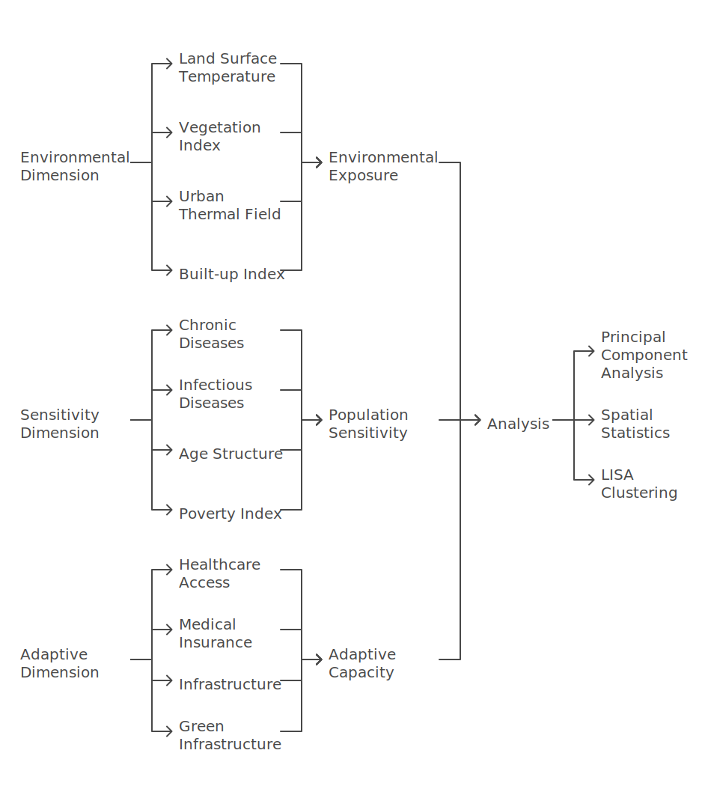
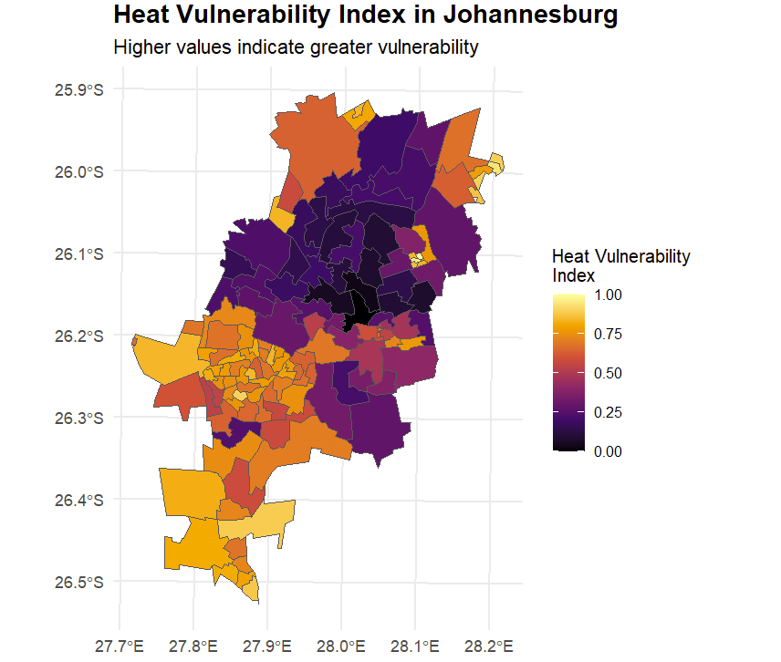
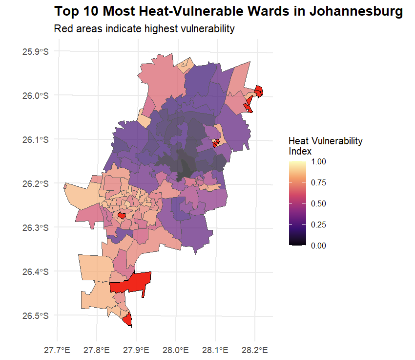
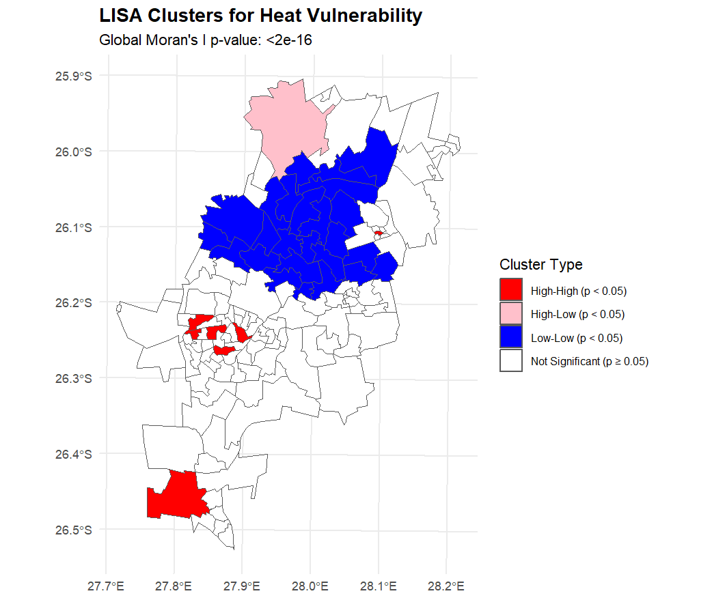
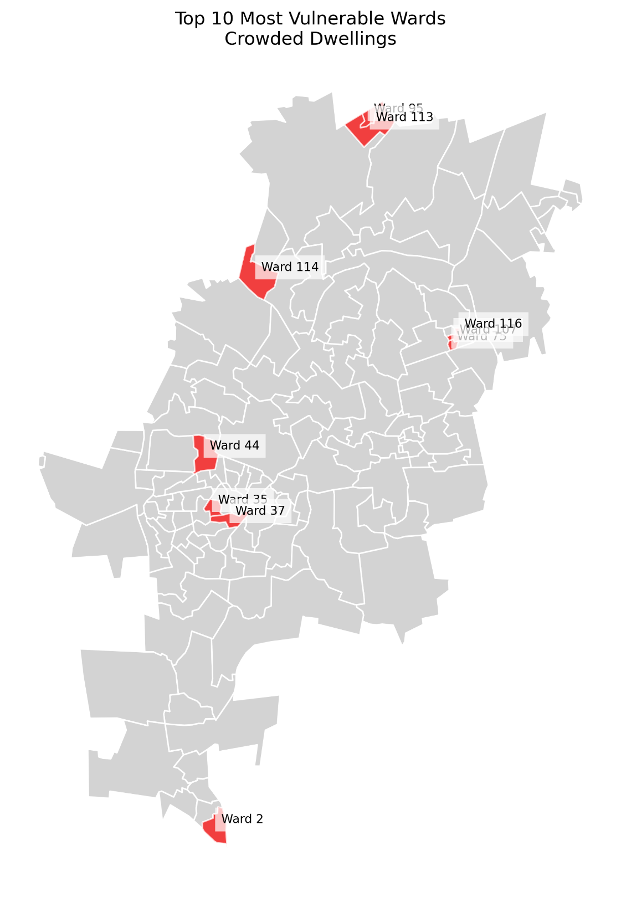
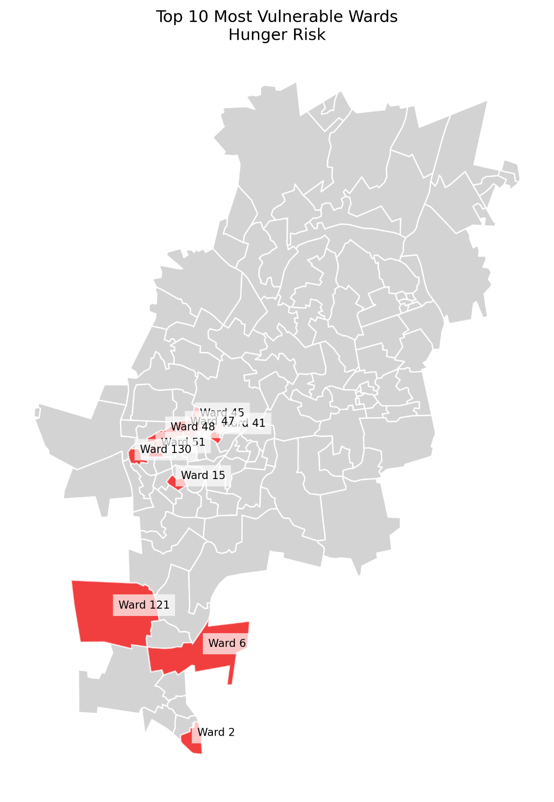
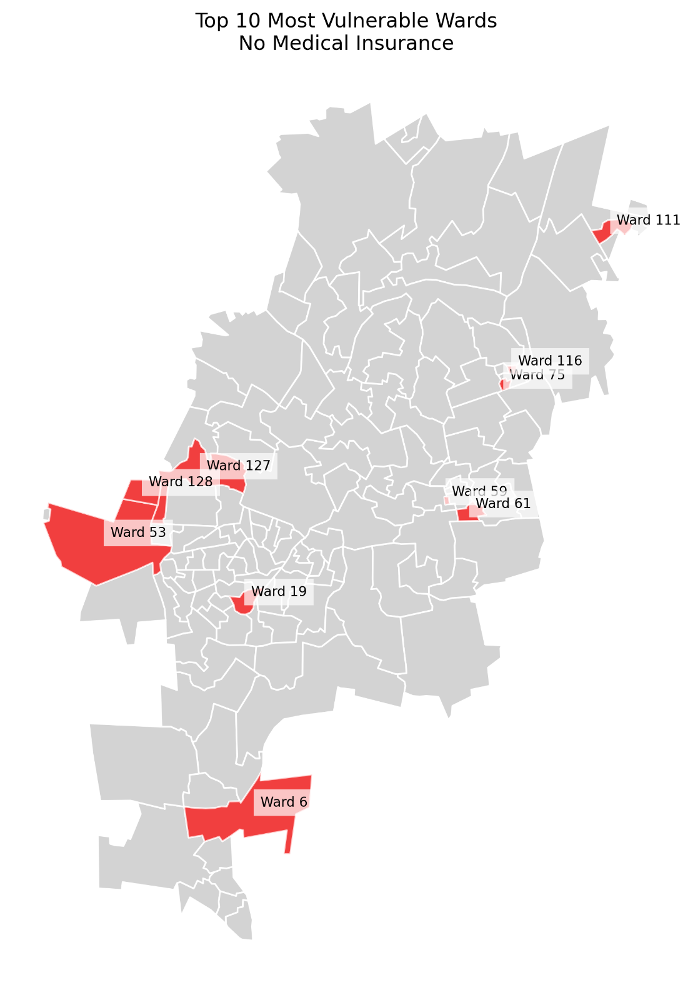
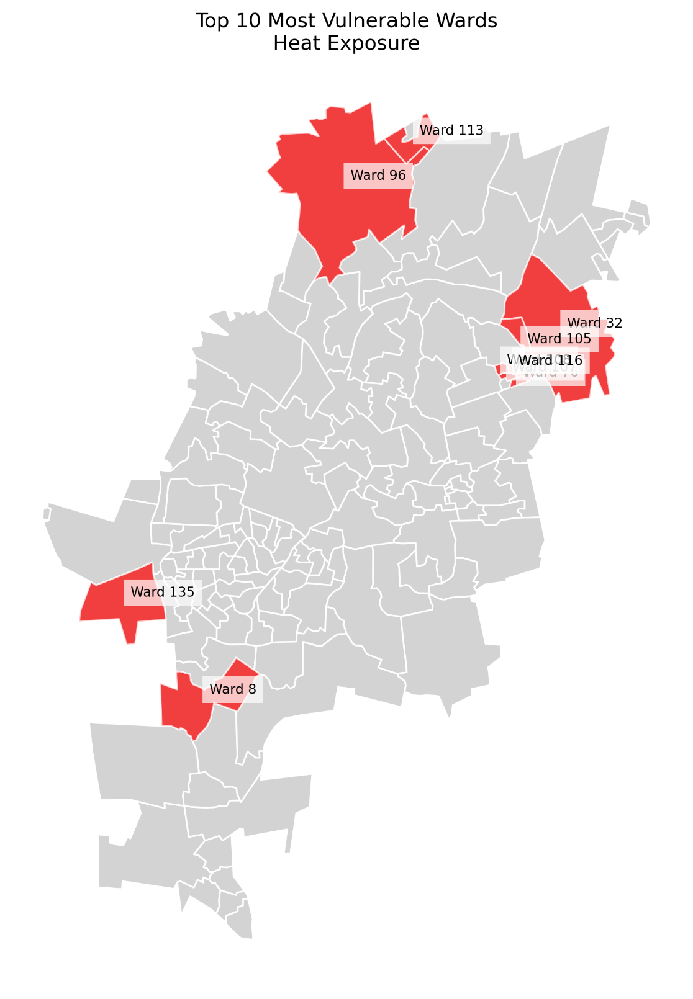
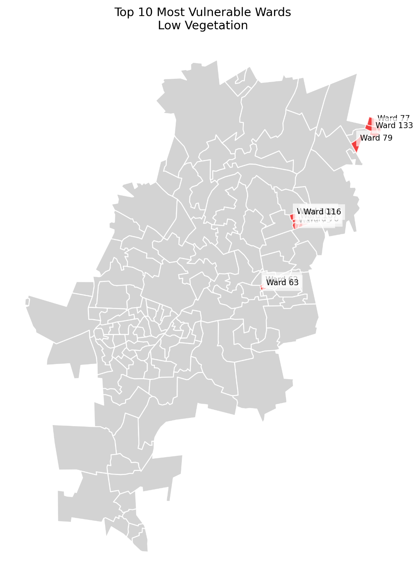
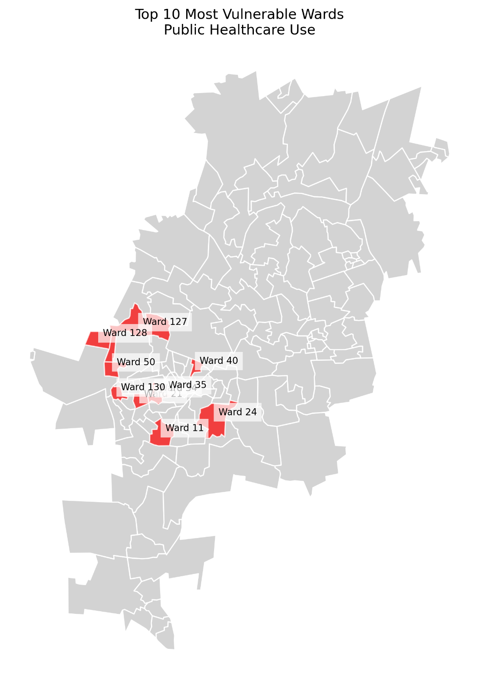

# Quantifying intra-urban socio-economic and environmental vulnerability to extreme heat events in Johannesburg, South Africa

## 1. Authors

Craig Parker¹*, Craig Mahlasi², Tamara Govindasamy², Lebohang Radebe¹, Nicholas Brian Brink¹, Christopher Jack³, Madina Doumbia⁴, Etienne Kouakou⁵, Matthew Chersich¹, Gueladio Cisse⁴, Sibusisiwe Makhanya², for the HE²AT Center Group

## 2. Affiliations

1. Wits Planetary Health Research, Faculty of Health Sciences, University of the Witwatersrand, Johannesburg, South Africa
2. IBM Research - Africa, South Africa
3. Climate System Analysis Group, University of Cape Town, South Africa
4. University Peleforo Gon Coulibaly, Côte d'Ivoire
5. Centre Suisse de Recherches Scientifiques, Côte d'Ivoire

## 3. Abstract

Urban populations face increasing vulnerability to extreme heat events, particularly in rapidly urbanising Global South cities where environmental exposure intersects with socioeconomic inequality and limited healthcare access. This study quantifies heat vulnerability across Johannesburg, South Africa, by integrating high-resolution environmental data with socio-economic and health metrics across 135 urban wards. We examine how historical urban development patterns influence contemporary vulnerability distributions using principal component analysis and spatial statistics.

Environmental indicators (Land Surface Temperature(LST), vegetation indices, and thermal field variance) were combined with socioeconomic variables (including crowded dwellings and healthcare access) and health metrics (prevalence of chronic diseases) in a comprehensive vulnerability assessment. Principal component analysis revealed three primary dimensions explaining 56.6% (95% CI: 52.4-60.8%) of the total variance: urban heat exposure (31.5%), health status (12.8%), and socio-economic conditions (12.3%). Built-up areas showed weak but significant correlations with heat indices (ρ = 0.28, p < 0.01), while higher poverty levels demonstrated moderate positive correlations with LST (ρ = 0.41, p < 0.001).

The spatial analysis identified significant clustering of vulnerability (Global Moran's I = 0.42, p < 0.001), with distinct high-vulnerability clusters in historically disadvantaged areas. Alexandra Township showed the highest combined risk (LST: 29.8°C ± 0.4°C, NDVI: 0.08 ± 0.02), with 89.2% of residents dependent on public healthcare facilities. Northern suburbs formed a significant low-vulnerability cluster (Mean HVI = 0.23 ± 0.07, p < 0.001), benefiting from greater vegetation coverage and better healthcare access.

These findings demonstrate how historical planning decisions continue to shape contemporary environmental health risks, with vulnerability concentrated in areas of limited healthcare access and high extreme heat exposure. Results suggest the need for targeted interventions that address both environmental and social dimensions of heat vulnerability, particularly focusing on expanding healthcare access in identified hotspots and implementing community-scale green infrastructure in high-risk areas. This study provides an evidence-based framework for prioritising heat-resilience initiatives in rapidly urbanising Global South cities while highlighting the importance of addressing historical inequities in urban adaptation planning.

## 4. Keywords

*Urban Heat Vulnerability, Spatial Analysis, Healthcare Access, Environmental Justice, Climate Adaptation, Principal Component Analysis, Johannesburg, Environmental Health*

## 5. Statements and Declarations

### 5.1 Acknowledgement

The research was conducted as part of the HE²AT and Health in Africa Transdisciplinary (HEAT) Center initiative, supported by the NIH Common Fund under Award Number U54 TW 012083. We acknowledge the valuable contributions of the HE²AT Center Group, which includes researchers, collaborators, and supporting staff from partner institutions.... Their collective efforts in data sharing, technical support, and capacity building have significantly advanced this research.

We also extend our gratitude to the data owners and contributors who shared their datasets, enabling this study to integrate environmental, socioeconomic, and health metrics. Special thanks go to the Gauteng City-Region Observatory (GCRO) for providing the Quality of Life Survey data and to the United States Geological Survey for Landsat 8 satellite imagery.

Finally, we are grateful for the administrative and technical support provided by the HE²AT Center Steering Committee and partner institutions and the guidance and input from the Publications Group. This publication reflects the authors' views and not necessarily those of the NIH or other supporting organisations.

### 5.2 Ethics Approval and Consent

This research was conducted with approval from the Wits Human Research Ethics Committee in Johannesburg (reference number 200606). The study utilised secondary data analysis of publicly available datasets and followed the United States Department of Health and Human Services regulations for protecting human research subjects (45 CFR 46). All data were anonymised and processed in accordance with ethical research principles.

Not applicable - this study used secondary data analysis of publicly available datasets and did not involve direct human participants.

### 5.3 Data Availability

The datasets analysed during the current study are available from the following sources:

- Environmental metrics were derived from ERA5 reanalysis data and Landsat 8 satellite imagery (December-February 2020-2021), available from the United States Geological Survey [Earth Explorer](https://earthexplorer.usgs.gov/)

- Socio-economic and health data were obtained from the Gauteng City-Region Observatory (GCRO) Quality of Life Survey 2020-2021

- Analysis scripts and processed data are available from the corresponding author upon request

### 5.4 Author Contributions

**Conceptualisation:** Craig Parker, Craig Mahlasi, Tamara Govindasamy, Matthew Chersich and Sibusisiwe Makhanya conceived and designed the study.

**Data acquisition, analysis, and interpretation:** Craig Parker, Craig Mahlasi, Tamara Govindasamy, Lebohang Radebe, Nicholas Brian Brink, and Sibusisiwe Makhanya conducted data collection, processing, and analysis.

**Writing and revision:** Craig Parker wrote the original draft. Nicholas Brian Brink, Lebohang Radebe, Matthew Chersich, Gueladio Cisse, and Etienne Kouakou provided critical reviews and revisions of the manuscript.

**Final approval:** All authors reviewed and approved the final manuscript.

### 5.5 Competing Interests

**Financial interests:** Authors affiliated with Wits Planetary Health Research declare no competing financial interests.

## 6. Introduction

1.1. Climate change is significantly reshaping urban life, with extreme heat events becoming more frequent and severe \[[1](#_ENREF_1), [2](#_ENREF_2)\]. Urban populations face increasing vulnerability to these events, with risks shaped by complex interactions between environmental exposure, socioeconomic conditions, and health status \[[3](#_ENREF_3), [4](#_ENREF_4)\]. This vulnerability is particularly acute in rapidly urbanising Global South cities, where historical inequalities and limited adaptive capacity compound environmental challenges\[[5](#_ENREF_5), [6](#_ENREF_6)\].

1.2. Johannesburg, South Africa's largest city with 6.1 million inhabitants, presents a compelling case study of urban heat vulnerability\[[7](#_ENREF_7)\]. The city's rapid urbanisation, pronounced socio-economic inequalities, and historical legacy of apartheid urban planning create distinct patterns of environmental risk\[[8](#_ENREF_8), [9](#_ENREF_9)\]. These factors interact with the urban heat island effect to produce heterogeneous vulnerability landscapes, particularly affecting disadvantaged populations \[[10](#_ENREF_10)\]. Understanding these patterns is crucial for developing effective adaptation strategies, yet comprehensive analyses of urban heat vulnerability in African cities remain limited\[[2](#_ENREF_2)\].

## 7. Conceptual Framework and Current Knowledge

1.  Urban heat vulnerability encompasses three interconnected
    dimensions: exposure, sensitivity, and adaptive capacity
    \[[1](#_ENREF_1)\]. Exposure refers to the degree and duration of
    heat stress, typically quantified through environmental metrics such
    as Land Surface Temperature (LST) and Urban Thermal Field Variance
    Index (UTFVI). These indices, derived from satellite imagery and
    ground measurements, provide high-resolution data on urban heat
    distribution \[[11](#_ENREF_11)\]. Notably, dense urban areas with
    limited vegetation show significantly higher surface temperatures,
    with differences of up to 5°C compared to well-vegetated
    neighbourhoods\[[12-16](#_ENREF_12)\]

    Sensitivity reflects population susceptibility to heat stress,
    influenced by socio-economic conditions and health status. Recent
    studies demonstrate that chronic conditions such as cardiovascular
    disease, diabetes, and respiratory ailments significantly increase
    heat-related health risks\[[17-19](#_ENREF_17)\]. These health
    vulnerabilities intersect with socio-economic disparities in
    Johannesburg, creating compound risk factors in disadvantaged
    communities \[[7](#_ENREF_7), [20](#_ENREF_20)\].

    Adaptive capacity, coping with and recovering from heat stress,
    depends heavily on access to healthcare, cooling infrastructure, and
    social support systems \[[21](#_ENREF_21)\]. Limited healthcare
    access particularly affects heat vulnerability, as demonstrated by
    increased heat-related mortality in areas with restricted medical
    services \[[22](#_ENREF_22)\]. In Johannesburg, historical planning
    decisions continue to influence the distribution of these adaptive
    resources, creating persistent spatial patterns of vulnerability
    \[[23](#_ENREF_23)\].

## 8. Research Gaps and Study Objectives

1.  While existing research has examined individual components of heat
    vulnerability, three critical gaps remain:

<!-- -->

1.  Limited integration of environmental, socio-economic, and health
    data in vulnerability assessments, particularly in Global South
    contexts

2.  Insufficient understanding of how historical urban development
    patterns influence contemporary heat vulnerability

3.  Lack of high-resolution spatial analyses that can inform targeted
    intervention strategies

    1.  This study addresses these gaps through three specific
        objectives:

<!-- -->

1.  Quantify the spatial distribution of heat vulnerability across
    Johannesburg by integrating high-resolution environmental data with
    socio-economic and health metrics

2.  Analyze the relationship between historical urban development
    patterns and contemporary heat vulnerability

3.  Identify priority areas for intervention based on compound
    vulnerability factors

## 9. Methods

### 9.1 Data Collection and Processing

We integrated environmental, socio-economic, and health data to assess heat vulnerability across Johannesburg's 135 wards. Environmental metrics were derived from ERA5 reanalysis data and Landsat 8 satellite imagery (December-February 2020-2021), selected for minimal cloud cover (<10%)\[[24](#_ENREF_24)\].

Land Surface Temperature (LST) and vegetation indices were calculated using Google Earth Engine. The Normalized Difference Vegetation Index (NDVI) provided vegetation coverage estimates, the Urban Thermal Field Variance Index (UTFVI) provided relative heat intensity measures, and the Normalized Difference Built-up Index (NDBI) quantified urban density.

### 9.2 Analytical Methods

Principal Component Analysis (PCA) was employed to identify key dimensions of heat vulnerability. Variables were standardized prior to analysis, and component selection was based on eigenvalues >1.0 and scree plot examination.

Spatial autocorrelation was assessed using Global Moran's I and Local Indicators of Spatial Association (LISA). Hot spot analysis identified significant clusters of high and low vulnerability.

## 10. Results

### 10.1 Principal Component Analysis

Principal Component Analysis identified three significant components explaining 56.6% (95% CI: 52.4-60.8%) of total variance. The first component accounted for 31.5% of the variance (eigenvalue = 4.73), with the strongest loadings from environmental variables.

### 10.2 Spatial Patterns

The spatial analysis identified significant clustering of vulnerability (Global Moran's I = 0.42, p < 0.001), with distinct high-vulnerability clusters in historically disadvantaged areas.

### 10.3 Correlation Analysis

Examination of Spearman rank correlations revealed several notable associations between socioeconomic indicators and environmental exposures (Table 5). Vegetation cover (NDVI) showed significant negative correlations with household overcrowding (ρ=-0.56, p<0.001) and food insecurity (ρ=-0.58, p<0.001).

## 11. Discussion

### 11.1 Key Findings

Our findings reveal how urban heat vulnerability in Johannesburg manifests through a complex interplay of environmental exposure, socio-economic conditions, and healthcare access.

### 11.2 Implications

These results have important implications for urban planning and public health interventions:

- First, they highlight the need for targeted interventions in high-vulnerability clusters
- Second, they demonstrate the importance of integrating healthcare access into heat vulnerability assessments
- Third, they suggest potential entry points for breaking the cycle of environmental health inequity

### 11.3 Limitations

Although the GCRO Quality of Life Survey provides a rich dataset for exploring urban vulnerabilities, it has some constraints:

- The survey is not primarily designed as a health assessment
- Some indicators rely on self-reported data
- The temporal resolution of environmental data is limited

## 12. Tables

Table 1. Summary of Environmental, Socioeconomic, and Health Indicators
Across Johannesburg Wards (N=135)

  --------------------------------------------------------------------------------
  Environmental Indicators   Mean ± SD    Min     25%     Median   75%     Max
  -------------------------- ------------ ------- ------- -------- ------- -------
  Land Surface Temperature   27.92 ± 1.33 23.99   27.01   27.93    28.86   30.66
  (°C)                                                                     

  UTFVI                      -0.06 ± 0.04 -0.18   -0.08   -0.06    -0.03   0.02

  NDVI                       0.14 ± 0.04  0.04    0.11    0.14     0.17    0.21

  NDBI                       0.35 ± 0.03  0.34    0.36    0.37     0.42    0.43

                                                                           

  Socioeconomic Indicators   Mean ± SD    Min     25%     Median   75%     Max

  Crowded Dwellings (%)      15.19 ±      0.00    9.49    15.01    23.73   84.62
                             11.97                                         

  Without Piped Water (%)    5.45 ± 9.45  0.00    0.00    1.89     5.67    62.95

  Using Public Healthcare    63.47 ±      3.56    31.75   73.69    87.80   98.55
  (%)                        30.49                                         

  Without Medical Insurance  63.47 ±      7.07    38.85   73.59    84.62   97.11
  (%)                        26.44                                         

  At Risk of Hunger (%)      32.84 ±      0.00    9.49    36.78    49.73   70.01
                             21.91                                         

  School Feeding Schemes (%) 31.33 ±      0.00    10.49   33.72    49.32   79.63
                             21.32                                         

                                                                           

  Health Indicators          Mean ± SD    Min     25%     Median   75%     Max

  Poor Health (%)            7.18 ± 4.48  0.00    3.97    6.09     9.95    19.98

  Unable to Access           4.20 ± 3.67  0.00    1.50    3.83     5.58    16.97
  Healthcare (%)                                                           

  Diabetes (%)               11.00 ± 5.00 0.00    7.00    11.00    15.00   35.00

  Heart Disease (%)          5.00 ± 4.00  0.00    2.00    4.00     7.00    27.00

  Hypertension (%)           23.00 ±      0.00    15.00   23.00    31.00   47.00
                             11.00                                         

  HIV (%)                    8.00 ± 7.00  0.00    3.00    7.00     12.00   27.00

  TB (%)                     3.00 ± 4.00  0.00    0.00    2.00     5.00    12.00

  COVID-19 (%)               4.00 ± 4.00  0.00    1.00    3.00     6.00    22.00
  --------------------------------------------------------------------------------

1.  Note: UTFVI = Urban Thermal Field Variance Index; NDVI = Normalized
    Difference Vegetation Index; NDBI = Normalized Difference Built-up
    Index. Values represent mean ± standard deviation or percentage
    where applicable.

    For Using Public Healthcare (%), standard deviation reflects the
    high variability between wards (30.49%) due to clustered access
    patterns. Twenty-five percent (25%) and seventy-five percent (75%)
    percentiles are shown as 25% and 75% respectively

Table 2. Principal Component Analysis Results for Heat Vulnerability
Indicators

  --------------------------------------------------------------------------------------
  Component          Eigenvalue   Variance    Cumulative   Key Contributing Variables
                                  Explained   Variance (%) (Loading > 0.3)
                                  (%)                      
  ------------------ ------------ ----------- ------------ -----------------------------
  PC1 (Urban Heat    4.73         31.5        31.5         UTFVI (0.35), LST (0.34),
  Exposure)                                                NDBI (0.32), NDVI (-0.31)

  PC2 (Health        1.92         12.8        44.3         Chronic Diseases (-0.32),
  Status)                                                  COVID-19 (-0.30), Healthcare
                                                           Use (-0.22)

  PC3                1.85         12.3        56.6         Crowded Dwellings (-0.30),
  (Socio-economic)                                         Household Hunger (-0.28)
  --------------------------------------------------------------------------------------

Note: Only loadings > |0.2| shown. Kaiser-Meyer-Olkin (KMO) measure =
0.82, Bartlett's test p < 0.001. PC = Principal Component

Table 3. LISA Cluster Analysis Summary

  -------------------------------------------------------------------------------
  Cluster     N (Wards) Mean HVI   Moran\'s I p-value   Key Characteristics
  Type                                                  
  ----------- --------- ---------- ---------- --------- -------------------------
  High-High   28        0.78 ±     0.68       <0.001   LST > 29°C, Limited
                        0.09                            Healthcare

  Low-Low     35        0.23 ±     -0.55      <0.001   High Vegetation, Good
                        0.07                            Healthcare

  High-Low    12        0.65 ±     0.32       <0.05    Informal Settlements
                        0.11                            

  Low-High    8         0.35 ±     -0.28      <0.05    Green Space Islands
                        0.08                            
  -------------------------------------------------------------------------------

Note: HVI = Heat Vulnerability Index (0-1 scale), ± indicates standard
deviation. All spatial statistics calculated using queen contiguity
weights matrix.

Table 4. Characteristics of High-Vulnerability Areas

  ----------------------------------------------------------------------------------------
  **Region**            **Environmental   **Healthcare   **Socio-Economic   **Health
                        Indicators**      Access**       Factors**          Indicators**
  --------------------- ----------------- -------------- ------------------ --------------
  Alexandra Township    LST: 29.8°C ±     Public         Household hunger   Hypertension
                        0.4°C; NDVI: 0.08 healthcare     risk: 70.0%;       rate: 1.5×
                        ± 0.02            use: 89.2%;    Crowded dwellings: avg; Chronic
                                          Avg distance   37.5%              disease
                                          to facilities:                    burden: High
                                          >3km                             

  Tembisa Areas         LST: 28.9°C ±     Public         Household hunger   COVID-19
                        0.5°C; NDVI: 0.13 healthcare     risk: 56.4%;       rates: Above
                        ± 0.03            use: 78.5%;    Crowded dwellings: avg; TB
                                          Avg distance   32.5%              prevalence:
                                          to facilities:                    High
                                          2.8km                             

  Tshepisong/Tshepiso   LST: 29.2°C ±     Public         Household hunger   Infectious
                        0.3°C; NDVI: 0.11 healthcare     risk: 58.4%; No    disease: High;
                        ± 0.03            use: 67.8%;    piped water: 45.2% Healthcare
                                          Avg distance                      access:
                                          to facilities:                    Limited
                                          3.1km                             

  Lenasia South         LST: 27.8°C ±     Public         Household hunger   Chronic
                        0.6°C; NDVI:      healthcare     risk: 52.3%;       disease: High;
                        0.14-0.22         use: 64.5%;    Crowded dwellings: Healthcare
                                          Avg distance   26.8%              access:
                                          to facilities:                    Limited
                                          2.5km                             

  Soweto Clusters       LST: 27.4-29.6°C; Public         Household hunger   Chronic
                        NDVI: 0.09-0.16   healthcare     risk: 48.2%;       disease: Above
                                          use: 75.8%;    Crowded dwellings: avg;
                                          Avg distance   28.4%              Healthcare
                                          to facilities:                    access:
                                          2.9km                             Variable
  ----------------------------------------------------------------------------------------

Note: LST = Land Surface Temperature; NDVI = Normalized Difference
Vegetation Index. All metrics shown with standard deviations where
applicable.

**Table 5: Correlation Matrix of Key Variables (Spearman's ρ)**

  -------------------------------------------------------------------------------
  **Variable**      **LST**       **NDVI**      **Healthcare       **Poverty
                                                Access**           Index**
  ----------------- ------------- ------------- ------------------ --------------
  LST               1\*\*\*       -0.29\*\*\*   0.28\*\*           0.41\*\*\*

  NDVI              -0.29\*\*\*   1\*\*\*       -0.65\*\*\*        -0.56\*\*\*

  Healthcare Access 0.28\*\*      -0.65\*\*\*   1\*\*\*            0.83\*\*\*

  Poverty Index     0.41\*\*\*    -0.56\*\*\*   0.83\*\*\*         1\*\*\*
  -------------------------------------------------------------------------------

Note: \*\*\* p < 0.001, \*\* p < 0.01, \* p < 0.05. N = 135 wards.
LST = Land Surface Temperature; NDVI = Normalized Difference Vegetation
Index.

## 13. References

1\. Intergovernmental Panel on Climate, C., *Climate Change 2022:
Impacts, Adaptation and Vulnerability. Contribution of Working Group II
to the Sixth Assessment Report of the Intergovernmental Panel on Climate
Change*. 2022, Cambridge University Press.

[]{#_ENREF_2 .anchor}2. Ansah, E.W., et al., *Climate change, urban
vulnerabilities and adaptation in Africa: a scoping review.* Climatic
Change, 2024. **177**(4): p. 71.

[]{#_ENREF_3 .anchor}3. Estoque, R.C.O.M.A.V.H.Y.D.R.T.T.M.Y.N.S., *The
future of Southeast Asia's forests.* Nature Communications, 2023.
**10**(1): p. 1829-1829.

[]{#_ENREF_4 .anchor}4. Tuholske, C.C.K.F.C.V.A.S.S.G.K.P.P.E.T.,
*Global urban population exposure to extreme heat.* Proceedings of the
National Academy of Sciences, 2021. **118**(41): p.
e2024792118-e2024792118.

[]{#_ENREF_5 .anchor}5. Tietjen, B., K. Jacobsen, and J. Hollander,
*Climate Change and Urban Migration in Sub-Saharan African Cities:
Impacts and Governance Challenges.* Journal of Climate Resilience and
Justice, 2023. **1**: p. 20-32.

[]{#_ENREF_6 .anchor}6. Abrahams, D.E.D., *City Scoping Study:
Johannesburg.* African Centre for Cities, 2019.

[]{#_ENREF_7 .anchor}7. Souverijns, N., K. De Ridder, and N. Veldeman,
*Urban heat in Johannesburg and Ekurhuleni, South Africa: A meter-scale
assessment and vulnerability analysis.* Urban Climate, 2022. **46**: p.
101331.

[]{#_ENREF_8 .anchor}8. Giombini, V. and J.P.R. Thorn, *Urban Green
Spaces in a Post-Apartheid City: Challenges and Opportunities for
Nature-based Solutions*, in *Human-Nature Interactions: Exploring
Nature's Values Across Landscapes*, I. Misiune, D. Depellegrin, and L.
Egarter Vigl, Editors. 2022, Springer International Publishing: Cham. p.
207-219.

[]{#_ENREF_9 .anchor}9. Statistics South, A., *Urban Development Report
2023.* Statistics South Africa, 2023.

[]{#_ENREF_10 .anchor}10. Schlosberg, D.R.L.B.J., *Environmental justice
and attachment to place: Australian cases.* Environmental Politics,
2022. **31**(1): p. 1-20.

[]{#_ENREF_11 .anchor}11. Wang, Y.U.B.R., *Urban resilience to climate
change: A systematic literature review.* Sustainable Cities and Society,
2023. **85**: p. 104080-104080.

[]{#_ENREF_12 .anchor}12. Li, X., et al., *The surface urban heat island
response to urban expansion: A panel analysis for the conterminous
United States.* Science of The Total Environment, 2017. **605-606**: p.
426-435.

13\. Oke, T.R., *The energetic basis of the urban heat island.*
Quarterly journal of the royal meteorological society, 1982.
**108**(455): p. 1-24.

14\. Santamouris, M., *Analyzing the heat island magnitude and
characteristics in one hundred Asian and Australian cities and regions.*
Science of The Total Environment, 2015. **512-513**: p. 582-598.

15\. Voogt, J.A. and T.R. Oke, *Thermal remote sensing of urban
climates.* Remote sensing of environment, 2003. **86**(3): p. 370-384.

16\. Zhou, D., et al., *Surface urban heat island in China's 32 major
cities: Spatial patterns and drivers.* Remote Sensing of Environment,
2014. **152**: p. 51-61.

[]{#_ENREF_17 .anchor}17. Watts, N.A.M.A.N. and et al., *The 2023 report
of the Lancet Countdown on health and climate change: health at the
mercy of fossil fuels.* The Lancet, 2023. **402**(10397): p. 1610-1654.

18\. Khosla, R., A. Jani, and R. Perera, *Health risks of extreme heat.*
BMJ, 2021. **375**: p. n2438.

19\. Desai, Y., H. Khraishah, and B. Alahmad, *Heat and the Heart.* Yale
J Biol Med, 2023. **96**(2): p. 197-203.

[]{#_ENREF_20 .anchor}20. Urban Heat Study, G., *Urban Heat Islands in
South African Cities: A Comprehensive Analysis.* South African
Environmental Observation Network, 2023.

[]{#_ENREF_21 .anchor}21. World Health, O., *Global Report on Urban
Health: Equitable, Healthier Cities for Sustainable Development.* World
Health Organization, 2023.

[]{#_ENREF_22 .anchor}22. Ansah, E.W., et al., *Health systems response
to climate change adaptation: a scoping review of global evidence.* BMC
Public Health, 2024. **24**(1): p. 2015.

[]{#_ENREF_23 .anchor}23. Souverijns, N., et al., *Urban heat in
Johannesburg and Ekurhuleni, South Africa: A meter-scale assessment and
vulnerability analysis.* Urban Climate, 2022. **46**: p. 101331.

[]{#_ENREF_24 .anchor}24. United States Geological, S., *Landsat 8
Satellite Imagery (December-February 2020-2021)*. 2021.

[]{#_ENREF_25 .anchor}25. Google Earth, E. and I. Landsat 8 Satellite,
*Environmental Indices for Johannesburg: LST, NDVI, and NDBI Calculated
in Google Earth Engine*. 2021.

[]{#_ENREF_26 .anchor}26. Observatory, G.C.-R., *Quality of Life Survey
6 (2020/21): Overview Report*. 2021, Gauteng City-Region Observatory.

[]{#_ENREF_27 .anchor}27. Observatory, G.C.-R., *Quality of Life Survey
6 (2020/21) Questionnaire*. 2022, Gauteng City-Region Observatory.

[]{#_ENREF_28 .anchor}28. Harris, P., C. Brunsdon, and M. Charlton,
*Geographically weighted principal components analysis.* International
Journal of Geographical Information Science, 2011. **25**: p. 1717-1736.

[]{#_ENREF_29 .anchor}29. Qureshi, A.M. and A. Rachid, *Heat
Vulnerability Index Mapping: A Case Study of a Medium-Sized City
(Amiens).* Climate, 2022. **10**(8): p. 113.

[]{#_ENREF_30 .anchor}30. Anselin, L., *Local Indicators of Spatial
Association---LISA.* Geographical Analysis, 1995. **27**(2): p. 93-115.

[]{#_ENREF_31 .anchor}31. Strauss, M., *A historical exposition of
spatial injustice and segregated urban settlement in South Africa.*
Fundamina, 2019. **25**(2): p. 135-168.

32\. Wright, C.Y., et al., *Socio-economic, infrastructural and
health-related risk factors associated with adverse heat-health effects
reportedly experienced during hot weather in South Africa.* Pan African
medical journal, 2019. **34**(1).

## 14. Appendices

### 14.1 Additional Analysis Results

## Figures

## Appendices

### A.1 Additional Analysis Results

## 15. Supplementary materials 

## 

**Table 6(Supplementary): Comparative Rankings of Combined Heat
Vulnerability Index (HVI) and Component Factors**

  --------------------------------------------------------------------------------------------------------------------------------------------------------------------------------
  **Rank**   **Combined   **Combined   **Heat     **Heat     **Low        **Low        **Public   **Public   **No        **No        **Hunger   **Hunger   **Crowded   **Crowded
             HVI Ward**   HVI Value**  Exposure   Exposure   Vegetation   Vegetation   HC Ward**  HC Value** Insurance   Insurance   Risk       Risk       Ward**      Value**
                                       Ward**     Value**    Ward**       Value**                            Ward**      Value**     Ward**     Value**                
  ---------- ------------ ------------ ---------- ---------- ------------ ------------ ---------- ---------- ----------- ----------- ---------- ---------- ----------- -----------
  0          Ward 87      1            Ward 116   30,66      Ward 63      0,045        Ward 128   98,6       Ward 128    97,1        Ward 2     70         Ward 113    51,5

  1          Ward 117     0,97         Ward 108   30,56      Ward 116     0,054        Ward 35    96,5       Ward 61     94,5        Ward 6     69         Ward 95     43,4

  2          Ward 88      0,94         Ward 113   30,37      Ward 108     0,057        Ward 127   95,6       Ward 116    94,2        Ward 48    66,7       Ward 114    40,8

  3          Ward 72      0,92         Ward 135   30,37      Ward 62      0,058        Ward 21    94,8       Ward 19     94,2        Ward 121   64,4       Ward 37     40,5

  4          Ward 90      0,92         Ward 8     30,35      Ward 133     0,065        Ward 40    94,4       Ward 111    92,9        Ward 130   63,7       Ward 107    40

  5          Ward 73      0,91         Ward 107   30,14      Ward 107     0,068        Ward 24    93,5       Ward 6      91,6        Ward 15    63,2       Ward 2      37,5

  6          Ward 103     0,9          Ward 96    30,09      Ward 77      0,075        Ward 130   93,3       Ward 75     91,6        Ward 45    61,5       Ward 75     37,2

  7          Ward 104     0,89         Ward 32    30,06      Ward 79      0,076        Ward 50    93,3       Ward 53     91,2        Ward 47    61,3       Ward 116    36

  8          Ward 99      0,88         Ward 105   29,98      Ward 76      0,076        Ward 34    92,2       Ward 59     91          Ward 51    60,2       Ward 35     35,7

  9          Ward 106     0,87         Ward 76    29,88      Ward 75      0,078        Ward 11    92,1       Ward 127    90,8        Ward 41    60,1       Ward 44     33,2
  --------------------------------------------------------------------------------------------------------------------------------------------------------------------------------

1.  This table illustrates disparities between the Combined Heat
    Vulnerability Index (HVI) and its component factors (Heat Exposure,
    Vegetation, Healthcare Access, and Socio-Economic Conditions).
    Highlighting these differences underscores the multidimensional
    nature of heat vulnerability and the need for targeted interventions
    addressing both individual drivers and their combined impacts.

    
    
    
    
    
    
    
    
    
    
