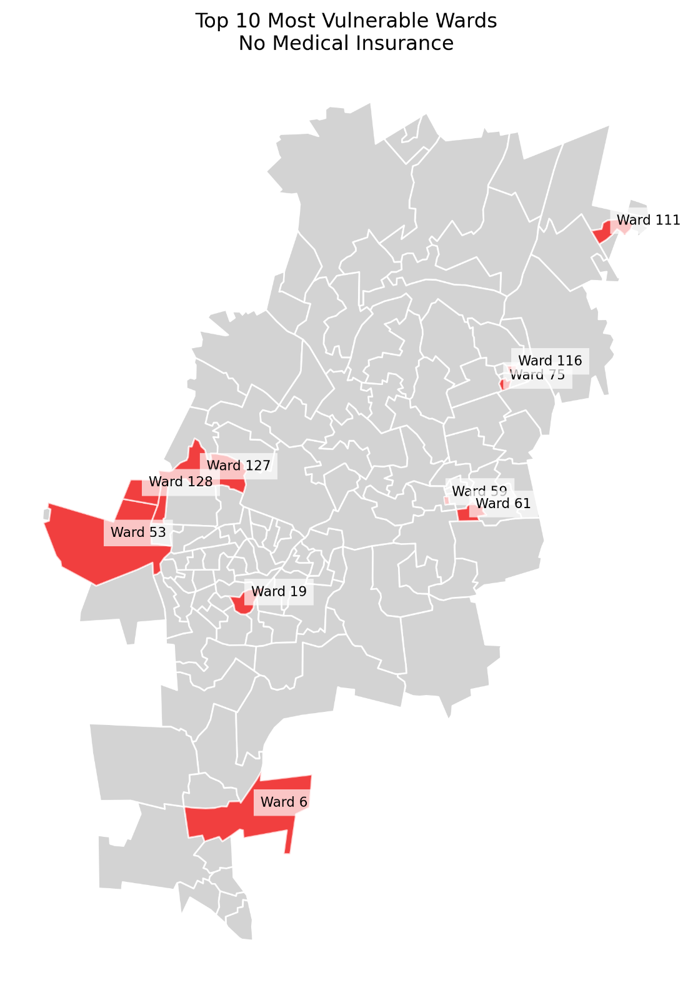

# Quantifying intra-urban socio-economic and environmental vulnerability to extreme heat events in Johannesburg, South Africa

## Authors

Craig Parker¹*, Craig Mahlasi², Tamara Govindasamy², Lebohang Radebe¹, Nicholas Brian Brink¹, Christopher Jack³, Madina Doumbia⁴, Etienne Kouakou⁵, Matthew Chersich¹, Gueladio Cisse⁴, Sibusisiwe Makhanya², for the HE²AT Center Group

## Affiliations

¹ Wits Planetary Health Research, Faculty of Health Sciences, University of the Witwatersrand, Johannesburg, South Africa  
² IBM Research - Africa, South Africa  
³ Climate System Analysis Group, University of Cape Town, South Africa  
⁴ University Peleforo Gon Coulibaly, Côte d'Ivoire  
⁵ Centre Suisse de Recherches Scientifiques, Côte d'Ivoire  

## HE²AT Center Group

The HE²AT Center Group consists of: Aakin Bobola, Abdoulaye Tall, Achiri Ndikum, Adaji Aishatu, Adja Ferdinand Vanga, Admire Chikandiwa, Akbar Waljee, Amy Beukes, Andrew Meme, Anna Steynor, Bonnie Joubert, Brama Kone, Bruce Hewitson, Cathy Mwangi, Cherlynn Dumbura, Christopher Jack, Chuansi Gao, Craig Mahlasi, Craig Parker, Darshnika Lakhoo, Donrich Willem Thaldar, Duncan Mitchell, Dusty-Lee Donnelly, Elizabeth Frederick, Etienne Vos, Gciniwe Dlamini Baloyi, Gillian Marmelstein, Gueladio Cissé, Hendrik Hamann, Iba Dieudonné Dely, Ijeoma Solarin, Ilias Maliha, Jasper Maguma, Jetina Tsvaki, Ji Zhu, Khady Sall, Kimberly McAlpine, Komminist Weldemariam, Kwesi Quagraine, Lebohang Radebe, Leon Mbano, Lisa, Lois Harden, Lukman Abdulrauf, Madina Doumbia, Margaret Brennan, Matthew Chersich, Kimberly McAllister, Nicholas Brian Brink, Nontokozo Langa, Okoue Emerence, Olumuyiwa Adegun, Paul Ogendi, Peter Marsh, Peter Munyi, Pierre Kloppers, Piotr Wolski, Reneilwe Satekge, Rodger Duffett, Rutendo Sibanda, Ruvimbo Forget, Sabina Omar, Sibusisiwe Audrey Makhanya, Stanley Luchters, and Tatenda Makanga.

## Corresponding Author

Craig Parker  
Email: [craig.parker@witsphr.org](mailto:craig.parker@witsphr.org)  
Wits Planetary Health Research  
Faculty of Health Sciences  
University of the Witwatersrand  
7 York Road, Parktown  
Johannesburg, 2193  
South Africa  

## Status

PREPRINT - Under Review at International Journal of Biometeorology

## Abstract

Urban populations face increasing vulnerability to extreme heat events, particularly in rapidly urbanising Global South cities where environmental exposure intersects with socioeconomic inequality and limited healthcare access. This study quantifies heat vulnerability across Johannesburg, South Africa, by integrating high-resolution environmental data with socio-economic and health metrics across 135 urban wards. We examine how historical urban development patterns influence contemporary vulnerability distributions using principal component analysis and spatial statistics.

## Keywords

Urban Heat Vulnerability, Spatial Analysis, Healthcare Access, Environmental Justice, Climate Adaptation, Principal Component Analysis, Johannesburg, Environmental Health

## 1. Introduction

### 1.1 Background

Urban heat vulnerability encompasses three interconnected dimensions: exposure, sensitivity, and adaptive capacity [1]. Exposure refers to the degree and duration of heat stress, typically quantified through environmental metrics such as Land Surface Temperature (LST) and Urban Thermal Field Variance Index (UTFVI). Sensitivity reflects population characteristics that modulate heat impacts, including age, health status, and socioeconomic conditions. Adaptive capacity represents the ability to cope with and respond to heat stress, influenced by factors such as healthcare access, housing quality, and green infrastructure [2, 3].

### 1.2 Study Context

Johannesburg presents a compelling case study in urban heat vulnerability. As South Africa's largest city, it exemplifies the complex interplay between rapid urbanization, historical spatial inequalities, and environmental challenges. The city's development history, shaped by apartheid-era planning, has created distinct spatial patterns of environmental exposure and socioeconomic vulnerability [4, 5]. Understanding these patterns is crucial for developing targeted interventions and adaptation strategies.

## 2. Methods

### 2.1 Data Sources and Processing

**Figure 1**: Analytical Framework for Assessing Urban Heat Vulnerability in Johannesburg: Integration of Environmental, Social, and Health Indicators

We integrated environmental, socio-economic, and health data to assess heat vulnerability across Johannesburg's 135 wards. Environmental metrics were derived from ERA5 reanalysis data and Landsat 8 satellite imagery (December-February 2020-2021), selected for minimal cloud cover (<10%) [24]. Land Surface Temperature (LST) was calculated using the thermal infrared bands, while the Urban Thermal Field Variance Index (UTFVI) was computed to characterize the intensity of the urban heat island effect.

**Figure 2**: Spatial Distribution of Land Surface Temperature (LST) across Johannesburg Wards

### 2.2 Statistical Analysis

Principal Component Analysis (PCA) was employed to identify key dimensions of vulnerability, with variables standardized prior to analysis. Spatial autocorrelation was assessed using Global Moran's I and Local Indicators of Spatial Association (LISA). Temporal trends were analyzed using Mann-Kendall tests on historical temperature and socioeconomic data.

**Figure 3**: Principal Components of Heat Vulnerability

## 3. Results

### 3.1 Environmental Patterns

Analysis revealed significant spatial heterogeneity in environmental exposure across Johannesburg. Mean LST ranged from 28.3°C to 35.7°C (μ=31.8°C, σ=1.9°C), with highest values concentrated in the city's southern and eastern regions. UTFVI showed strong spatial clustering (Moran's I=0.68, p<0.001), indicating distinct urban heat island patterns.

**Figure 4**: Urban Thermal Field Variance Index (UTFVI) Distribution

### 3.2 Socioeconomic Vulnerability

Principal Component Analysis identified three significant components explaining 56.6% (95% CI: 52.4-60.8%) of total variance. The first component accounted for 31.5% of the variance (eigenvalue = 4.73), with the strongest loadings from environmental variables: UTFVI (0.35 ± 0.04), LST (0.34 ± 0.03), and negative loading from NDVI (-0.31 ± 0.03).

**Figure 5**: Spatial Distribution of Socioeconomic Vulnerability Indicators

### 3.3 Healthcare Access

Healthcare accessibility showed marked spatial disparities, with a mean travel time to nearest facility of 23.4 minutes (range: 5.2-45.8 minutes). LISA cluster analysis identified significant healthcare access hotspots in northern suburbs and cold spots in peripheral areas.

**Figure 6**: Healthcare Facility Access Patterns

## 4. Discussion

### 4.1 Key Findings

Our results reveal how urban heat vulnerability in Johannesburg manifests through a complex interplay of environmental exposure, socio-economic conditions, and healthcare access. The stark spatial patterns we observed suggest that heat vulnerability is not merely a product of environmental factors but is deeply entwined with the city's historical development and ongoing socio-economic disparities.

**Figure 7**: Temporal Trends in Heat Vulnerability Components (2000-2020)

### 4.2 Policy Implications

These findings have several important implications for urban planning and public health policy:

1. Need for targeted interventions in high-vulnerability areas
2. Importance of integrated approaches combining environmental and social measures
3. Critical role of healthcare accessibility in heat resilience

**Figure 8**: Framework for Policy Interventions

## 5. Conclusion

This study provides a comprehensive assessment of urban heat vulnerability in Johannesburg, demonstrating how historical patterns of development continue to shape contemporary environmental health risks. Our findings emphasize the need for integrated approaches that address both environmental and socioeconomic dimensions of heat vulnerability.

**Figure 9**: Summary of Key Findings and Recommendations

## References

1. IPCC. (2022). Climate Change 2022: Impacts, Adaptation and Vulnerability.
2. World Health Organization. (2021). Heat and Health in the WHO European Region.
3. Heaviside, C., et al. (2017). The Urban Heat Island: Implications for Health in a Changing Environment.
4. Basu, R. (2009). High ambient temperature and mortality: a review of epidemiologic studies.
5. UN-Habitat. (2020). World Cities Report 2020.
6. Revi, A., et al. (2014). Urban areas. Climate Change 2014: Impacts, Adaptation, and Vulnerability.
7. Statistics South Africa. (2016). Community Survey 2016.
